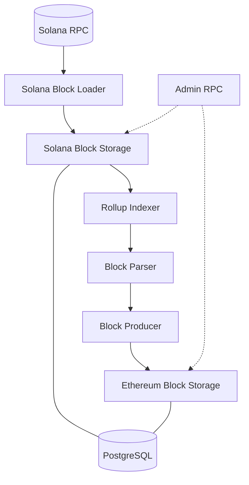

# Hercules

Hercules indexes Rome EVM transactions on Solana. It reads Solana blocks, extracts the
transactions that target the Rome EVM program, converts them to Ethereum-format blocks,
transactions and receipts, and stores them in PostgreSQL. The Proxy serves `eth_*` reads
(blocks, receipts, logs) from this database, and `rome-via-sync` mirrors it for the
Rome Via explorer.

Hercules is a thin binary over the indexer engine in `rome-sdk`
(`rome-evm-client/src/indexer`).

## Components



- **Solana Block Loader** (optional): fetches Solana blocks over RPC, keeps the
  transactions for the Rome EVM program and writes them to Solana Block Storage. It can be
  omitted when the Solana block tables are populated by another Hercules instance (for
  example through database replication).
- **Solana Block Storage**: persists Solana blocks in PostgreSQL.
- **Rollup Indexer**: drives parsing and block production, with retries and error handling.
- **Block Parser**: walks Solana blocks in order and decodes Rome EVM instructions (signed
  `DoTx`, Solana-native `DoTxUnsigned`, iterative transactions) into Ethereum transactions
  and execution results.
- **Block Producer**: assigns block numbers and hashes. In single-state mode it derives
  them from the Solana block.
- **Ethereum Block Storage**: persists EVM blocks, transactions and receipts in PostgreSQL.
- **Admin RPC**: read-only JSON-RPC status interface.

## Admin RPC

Served on the `admin_rpc` address. All methods are read-only.

| Method | Returns |
|---|---|
| `inSync()` | `true` when the indexer has caught up with the latest Solana block. |
| `lastSolanaStorageSlot()` | Last Solana slot in Solana Block Storage, or `null`. |
| `lastEthereumStorageSlot()` | Last Solana slot that has produced EVM blocks, or `null`. |
| `lastIndexedSlot()` | Current indexing progress. |

```sh
curl -s -X POST http://127.0.0.1:8000 -H 'Content-Type: application/json' \
  -d '{"jsonrpc":"2.0","method":"lastIndexedSlot","params":[],"id":1}'
```

> **Security:** bind `admin_rpc` to `127.0.0.1` or a private interface. The admin RPC must
> not be exposed publicly.

## Configuration

`HERCULES_CONFIG` must point to a YAML or JSON file.

| Key | Required | Description |
|---|---|---|
| `start_slot` | yes | Solana slot to start indexing from. |
| `end_slot` | no | Slot to stop at. Only used in `Recovery` mode. |
| `admin_rpc` | yes | Admin RPC bind address, `<IP>:<PORT>`. Use `127.0.0.1:8000`. |
| `mode` | no | `Indexer` (default; continuous indexing) or `Recovery` (backfill between `start_slot` and `end_slot`; indexing of new blocks is disabled). |
| `indexing_interval_ms` | no | Poll interval for new blocks. Default `400`. |
| `storage.connection.database_url` | yes | `postgres://<user>:<password>@<host>/<database>` |
| `storage.connection.max_connections` | no | Pool size. Default `32`. |
| `storage.connection.connection_timeout_sec` | no | Connection timeout. Default `60`. |
| `block_loader` | no | Solana Block Loader settings (below). Omit if Solana blocks are populated elsewhere. |
| `rollup_indexer` | no | Rollup Indexer settings (below). Omit for a loader-only instance. |

### `block_loader`

| Key | Description |
|---|---|
| `program_id` | Base58 address of the Rome EVM program. |
| `batch_size` | Blocks fetched in parallel. Larger values speed up catch-up on a good connection. |
| `block_retries` | Retries per block. |
| `tx_retries` | Retries per transaction. |
| `retry_int_sec` | Delay between retries, in seconds. |
| `commitment` | `confirmed` or `finalized`. |
| `client.providers` | List of Solana RPC URLs. |
| `client.emergency_providers` | Optional fallback RPC URLs, used only when all providers fail. |
| `client.timeout_sec` | Optional per-request timeout. |

Provider URLs are redacted in logs, so API keys in query strings are not leaked.

### `rollup_indexer`

| Key | Description |
|---|---|
| `max_slot_history` | Optional. Number of Solana blocks to keep in Solana Block Storage; all if unset. |
| `block_parser.program_id` | Optional. Defaults to `block_loader.program_id`. |
| `block_parser.chain_id` | Chain ID of the rollup within the Rome EVM program. |
| `block_parser.parse_mode` | `single_state`: all Rome EVM transactions in a Solana block go into one EVM block. |
| `block_producer.type` | `single_state`. Must match the parse mode. |

Recent `rome-sdk` revisions also provide a slot-aligned single-state variant, where the EVM
block number equals the Solana slot (one block per slot, empty blocks for empty slots).
It is intended for new chains only. See the `rome-sdk` indexer documentation for that mode.

### Example

```yaml
start_slot: 0
admin_rpc: "127.0.0.1:8000"   # never expose publicly
mode: Indexer
indexing_interval_ms: 400

storage:
  connection:
    database_url: "postgres://hercules:<password>@postgres/hercules"
    max_connections: 16
    connection_timeout_sec: 30

block_loader:
  program_id: "<ROME_EVM_PROGRAM_ID>"
  batch_size: 64
  block_retries: 10
  tx_retries: 100
  retry_int_sec: 1
  commitment: "confirmed"
  client:
    providers:
      - "http://solana1:8899"
      - "http://solana2:8899"

rollup_indexer:
  max_slot_history: 4096
  block_parser:
    chain_id: 1001
    parse_mode: single_state
  block_producer:
    type: single_state
```

### Database migrations

Hercules uses diesel migrations shipped with `rome-sdk`
(`rome-evm-client/src/indexer/pg_storage/migrations`). The Docker image includes them under
`/opt/migrations`. Run `/opt/apply_migrations` with `DATABASE_URL` set before starting
Hercules against a new database.

## Telemetry and logging

| Variable | Description |
|---|---|
| `ENABLE_OTEL_TRACING` | `true` to export OpenTelemetry traces. |
| `ENABLE_OTEL_METRICS` | `true` to export OpenTelemetry metrics. |
| `OTLP_RECEIVER_URL` | OTLP receiver endpoint, e.g. `http://otel-collector:4317`. |
| `ENABLE_STDOUT_LOGGING_ENV` | `false` to disable JSON logging on stdout (enabled by default). |

```yaml
environment:
  ENABLE_OTEL_TRACING: "true"
  ENABLE_OTEL_METRICS: "true"
  OTLP_RECEIVER_URL: "http://otel-collector:4317"
  ENABLE_STDOUT_LOGGING_ENV: "true"
```

Hercules shuts down gracefully on SIGTERM / SIGINT.
